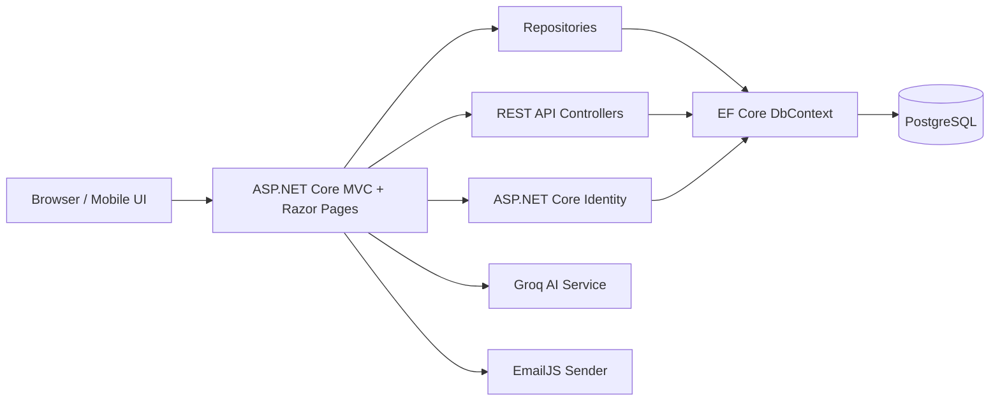
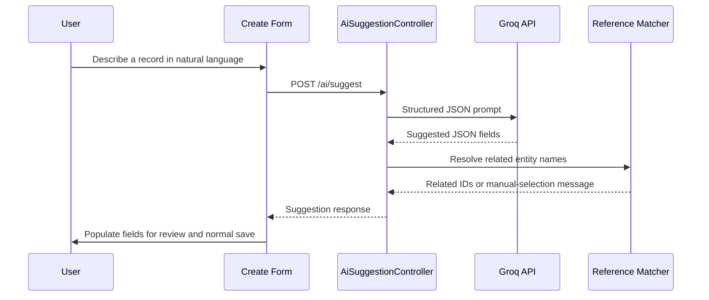
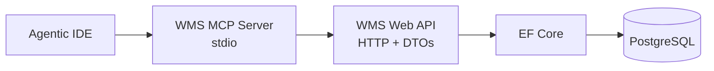
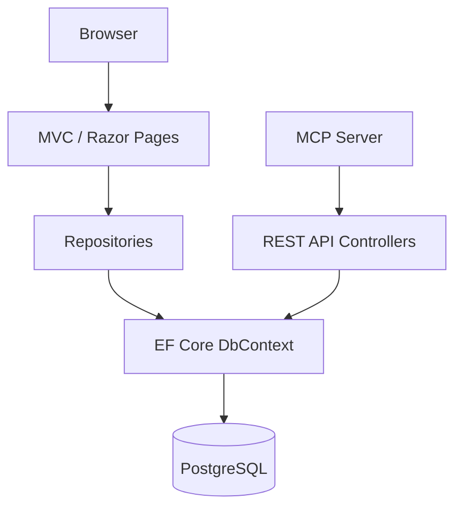

# Warehouse Management System

[](https://dotnet.microsoft.com/apps/aspnet)
[](https://dotnet.microsoft.com/)
[](https://learn.microsoft.com/ef/core/)
[](https://www.postgresql.org/)
[](LICENSE.txt)

**Warehouse Management System (WMS)** is a full-stack logistics application for managing warehouses, storage locations, products, inventory, suppliers, purchase orders, and purchase order items. It combines an ASP.NET Core MVC interface with a REST API, PostgreSQL persistence, Identity-based access control, AI-assisted form completion, automated tests, and a Model Context Protocol (MCP) server for agentic IDE workflows.

The project is designed around practical warehouse operations: records are connected through meaningful relationships, business rules prevent invalid deletions, and the dashboard turns operational data into immediately useful summaries. The user interface is responsive, supports asynchronous search and autocomplete controls, and provides a focused workflow for both operators and administrators.

> [!NOTE]
> This repository intentionally contains no credentials. Connection strings, OAuth values, EmailJS keys, and Groq API keys must be supplied through User Secrets for local development or Azure App Service settings for deployment.

---

## ☁️ Live Deployment

The application is deployed to Microsoft Azure and can be accessed without local setup.

🌐 **Live application:**

👉 [Warehouse Management System on Azure](https://wms-app-ejefdafvhsb4abca.francecentral-01.azurewebsites.net)

The App Service uses Azure Database for PostgreSQL Flexible Server. On a cold start, the first request may take a few seconds while the free App Service plan wakes up.

The live environment uses the same application code and feature set as the local web application. Data and user accounts in the deployed database are separate from local Docker data.

---

## ✨ Features

### 🏢 Warehouse management

- Create, read, update, and delete warehouse records.
- Store warehouse name, address, city, country, and capacity.
- View aggregate metrics on the warehouse index: record count, total capacity, and the largest warehouse.
- Browse related warehouse views by city, country, or capacity threshold.
- View linked locations and purchase orders through the warehouse detail workflow.

### 📦 Product and category management

- Maintain products with a description, price, weight, received timestamp, and category.
- Maintain categories and inspect categories with or without linked products.
- Search products by name, description, price, weight, or category.
- Filter products by category, minimum price, or similar weight.
- Safeguard category and product deletion when dependent records would violate the configured business rules.

### 📍 Location and inventory management

- Model storage locations with a code, zone, shelf number, and parent warehouse.
- Track inventory quantities at a product-location level.
- View low-stock records and filter inventory by product or location.
- Filter locations by zone, warehouse, or minimum shelf number.
- Use reusable AJAX autocomplete controls to select connected records such as products, locations, warehouses, suppliers, categories, and purchase orders.

### 🚚 Supplier and purchasing workflows

- Manage supplier contact details, including contact person, email, telephone number, and address.
- Create purchase orders with an order number, supplier, destination warehouse, dates, total value, and lifecycle status.
- Track purchase-order items with product, quantity, unit price, and calculated financial context.
- Explore supplier-specific purchase orders, purchase-order status, overdue orders, order items by product/order, and high-value items.
- Support the order lifecycle values `Pending`, `Approved`, `Shipped`, `Delivered`, and `Cancelled`.

### 🔎 Search, usability, and responsive UI

- AJAX list search across every primary entity index; returned partial views replace only the table body.
- Search feedback with debouncing, active-request cancellation, skeleton loading, empty states, and row-enter animations.
- Global sidebar search across application pages/actions and stored warehouses, products, suppliers, categories, locations, inventory records, purchase orders, and purchase-order items.
- Custom date-time picker partial with Croatian and English browser-aware formatting.
- Responsive layouts for authentication, dashboard, list pages, tables, detail pages, and operational cards.
- Global page loader, toast notifications, status/stock previews, and form-focused validation feedback.

### 👥 Authentication and authorization

- ASP.NET Core Identity with a custom `AppUser` that stores OIB, JMBG, optional telephone number, and avatar metadata.
- Registration, local login, logout, password reset, email confirmation/change, profile management, and personal-data download/deletion workflows.
- Google OAuth external login and account linking.
- Avatar upload through Dropzone with client preview, file-type validation, a 2 MB limit, and AJAX deletion.
- Three application roles: `Admin`, `Operator`, and `Guest`.
- Guest sign-in provides read-only list access; MVC details and write operations require authenticated roles, while deletion is reserved for administrators.

### 🤖 AI-assisted form entry

- An operator or administrator can describe an entity in natural language and generate suggested form values before saving.
- The AI assistant supports categories, warehouses, suppliers, products, locations, inventory, purchase orders, and purchase-order items.
- Groq is instructed to return structured JSON only; application code parses the response before populating fields.
- Reference matching resolves existing category, warehouse, supplier, product, location, and purchase-order IDs where possible, while asking the user to choose manually when no exact match exists.
- Generated data is a suggestion only. Standard client-side and server-side validation still decide whether a record can be saved.

### 🧠 Agent-ready MCP integration

- A dedicated stdio MCP server exposes read-oriented tools for all eight domain entities.
- Each entity provides list, get-by-ID, search, and one business-oriented overview/query tool.
- MCP tools call the Web API over HTTP rather than accessing PostgreSQL directly, preserving the API as the integration boundary.

### 📋 Logging and observability

- Serilog writes rolling daily logs to `Logs/wms-log-.txt`.
- MVC, authentication, AI, and error paths record important create/update/delete actions, rejected business-rule operations, and authentication events.
- Microsoft and EF Core framework noise is reduced through configured log-level overrides.

---

## 🛠 Tech Stack

| Area | Technologies |
| --- | --- |
| Web application | ASP.NET Core MVC, Razor Views, Razor Pages, C# 12, .NET 8 |
| REST API | ASP.NET Core Web API controllers, DTOs, LINQ |
| Persistence | Entity Framework Core 8, Npgsql, PostgreSQL |
| Authentication | ASP.NET Core Identity, Google OAuth, role-based authorization |
| Front end | Bootstrap, jQuery, jQuery Validation, jQuery Unobtrusive Validation, Dropzone |
| AI | Groq OpenAI-compatible chat-completions API, structured JSON responses |
| Email | EmailJS through `IEmailSender` |
| Logging | Serilog, Serilog ASP.NET Core, rolling file sink |
| Testing | xUnit, FluentAssertions, `WebApplicationFactory`, EF Core InMemory, Playwright |
| MCP | Model Context Protocol .NET SDK, stdio transport, `HttpClient` |
| Local infrastructure | Docker Compose, PostgreSQL 16, pgAdmin |
| Cloud deployment | Azure App Service and Azure Database for PostgreSQL Flexible Server |

> [!IMPORTANT]
> The web, model, data-access, and test projects target **.NET 8**. The standalone MCP project currently targets **.NET 9**, so the .NET 9 SDK is additionally required when building or running MCP locally.

---

## 🏗 Architecture

The solution follows a layered architecture. The MVC web project owns the presentation layer, controllers coordinate application workflows, repositories encapsulate data access, the DAL project owns Entity Framework Core configuration, and the model project contains shared domain classes.

| Project | Responsibility |
| --- | --- |
| `WarehouseManagementSystem.Web` | ASP.NET Core MVC UI, REST API controllers, Razor Identity pages, authorization, repositories, DTOs, AI and email services, shared JavaScript/CSS, logging, and application startup. |
| `WarehouseManagementSystem.DAL` | `WarehouseManagementSystemDbContext`, PostgreSQL provider configuration, EF Core migrations, entity relationship rules, and seed data. |
| `WarehouseManagementSystem.Model` | Domain entities (`Warehouse`, `Location`, `Product`, `Inventory`, `Category`, `Supplier`, `PurchaseOrder`, `PurchaseOrderItem`) plus `AppUser` and `OrderStatus`. |
| `WarehouseManagementSystem.Mcp` | A separate stdio MCP host that discovers annotated tools and calls the Web API using `HttpClient`. |
| `WarehouseManagementSystem.Tests` | API/integration tests, Identity tests, and end-to-end Playwright scenarios for primary CRUD workflows. |



### Request flow

1. A browser request reaches an MVC controller or Razor Page.
2. Authorization is evaluated for the requested MVC action.
3. The controller asks a repository for domain data or changes.
4. EF Core maps the domain model to PostgreSQL through `WarehouseManagementSystemDbContext`.
5. Views render responsive HTML; jQuery handles AJAX search, autocomplete, validation helpers, and interface feedback.

The REST API uses DTOs rather than serializing EF entities directly. `ApiMapper` maps entities to response DTOs and maps create/update DTOs back into domain objects, keeping the HTTP contract separate from persistence objects.

---

## 📂 Project Structure

```text
WarehouseManagementSystem/
│
├── WarehouseManagementSystem.Web/           # MVC UI, REST API, Identity, services
│   ├── Areas/Identity/Pages/                 # Scaffolded and customized Identity pages
│   ├── Controllers/
│   │   ├── Api/                              # REST API controllers
│   │   ├── AiSuggestionController.cs
│   │   └── GlobalSearchController.cs
│   ├── Dtos/                                 # API response/create/update contracts
│   ├── Models/AI/                            # AI request, response and suggestion models
│   ├── Repositories/                         # Entity-specific data access and dashboard queries
│   ├── Services/
│   │   ├── AI/                               # Groq prompts, API client and reference matching
│   │   └── Email/                            # EmailJS IEmailSender implementation
│   ├── Views/                                # Entity CRUD, partials, dashboard and welcome screen
│   └── wwwroot/                              # CSS, JavaScript, uploads and client libraries
│
├── WarehouseManagementSystem.DAL/            # DbContext and EF Core migrations
│   ├── Data/WarehouseManagementSystemDbContext.cs
│   └── Migrations/
│
├── WarehouseManagementSystem.Model/          # Domain entities and enum types
│
├── WarehouseManagementSystem.Mcp/            # Stdio MCP server and tool definitions
│   ├── Tools/
│   ├── Program.cs
│   └── appsettings.json
│
├── WarehouseManagementSystem.Tests/          # API, identity and browser tests
│   ├── Api/
│   ├── E2E/
│   └── Infrastructure/
│
├── docker-compose.yml                         # Local PostgreSQL + pgAdmin environment
├── WarehouseManagementSystem.sln
└── LICENSE.txt
```

---

## 🌐 MVC and REST API Design

The application exposes two complementary web surfaces:

- **MVC routes** provide the authenticated operational UI, shared layouts, forms, detail pages, AJAX partials, and browser workflows.
- **REST API routes** provide JSON DTOs for all core entity types and are used by integration tests and the MCP integration boundary.

### MVC access model

| Capability | Guest / Anonymous | Operator | Admin |
| --- | :---: | :---: | :---: |
| Entity indexes and AJAX search | ✅ | ✅ | ✅ |
| Entity details | ❌ | ✅ | ✅ |
| Create and edit | ❌ | ✅ | ✅ |
| Delete | ❌ | ❌ | ✅ |
| AI form suggestions | ❌ | ✅ | ✅ |

`Guest` is a special signed-in user role used for read-only list exploration. The public index/search endpoints also allow anonymous browsing.

### REST endpoint families

Every core entity has the same CRUD-shaped REST API family. Collection endpoints support an optional `query` parameter where implemented by the corresponding controller.

| Resource | Collection endpoint | Item endpoint | Operations |
| --- | --- | --- | --- |
| Categories | `GET /api/categories` | `/api/categories/{id}` | GET, POST, PUT, DELETE |
| Warehouses | `GET /api/warehouses` | `/api/warehouses/{id}` | GET, POST, PUT, DELETE |
| Products | `GET /api/products` | `/api/products/{id}` | GET, POST, PUT, DELETE |
| Inventory | `GET /api/inventories` | `/api/inventories/{id}` | GET, POST, PUT, DELETE |
| Locations | `GET /api/locations` | `/api/locations/{id}` | GET, POST, PUT, DELETE |
| Suppliers | `GET /api/suppliers` | `/api/suppliers/{id}` | GET, POST, PUT, DELETE |
| Purchase orders | `GET /api/purchase-orders` | `/api/purchase-orders/{id}` | GET, POST, PUT, DELETE |
| Purchase-order items | `GET /api/purchase-order-items` | `/api/purchase-order-items/{id}` | GET, POST, PUT, DELETE |

Example request:

```http
GET /api/products?query=laptop
Accept: application/json
```

Example product create payload:

```json
{
  "name": "Industrial Barcode Scanner",
  "description": "Handheld scanner for receiving and picking workflows.",
  "price": 189.99,
  "weight": 0.45,
  "productReceivedAt": "2026-07-10T09:30:00",
  "categoryId": 1
}
```

### Additional HTTP endpoints

| Endpoint | Purpose |
| --- | --- |
| `GET /global-search?term=...` | Returns up to 20 navigation and data search results as JSON. |
| `POST /ai/suggest` | Generates an AI form suggestion for a supported entity; requires `Admin` or `Operator` and an antiforgery token. |
| `GET /{entity}/search?term=...` | Returns the matching table-body partial for AJAX list search. |
| `GET /{entity}/autocomplete?term=...` | Returns compact JSON options for custom autocomplete fields where applicable. |

---

## 🗄 Database

### Provider and initialization

The persistence layer uses **PostgreSQL** through the Npgsql EF Core provider. In local development, the supplied Docker Compose configuration starts PostgreSQL 16 and pgAdmin. In Azure, the application is configured for Azure Database for PostgreSQL Flexible Server.

`WarehouseManagementSystemDbContext` derives from `IdentityDbContext<AppUser>`, so one database stores both operational records and ASP.NET Core Identity tables.

EF Core migrations are stored in `WarehouseManagementSystem.DAL/Migrations`. They create the domain schema, seed initial operational data, restore the selected restrictive delete rules, and add the customized Identity schema.

### Domain model

| Entity | Key data | Primary relationships |
| --- | --- | --- |
| `Warehouse` | Name, address, city, country, capacity | One-to-many with locations and purchase orders |
| `Location` | Code, zone, shelf number | Belongs to warehouse; one-to-many with inventory |
| `Category` | Name, description | One-to-many with products |
| `Product` | Description, price, weight, received timestamp | Belongs to category; one-to-many with inventory and purchase-order items |
| `Inventory` | Quantity, last-updated timestamp | Belongs to one product and one location |
| `Supplier` | Contact person, email, phone, address | One-to-many with purchase orders |
| `PurchaseOrder` | Number, dates, total amount, status | Belongs to supplier and warehouse; one-to-many with order items |
| `PurchaseOrderItem` | Quantity, unit price | Belongs to purchase order and product |
| `AppUser` | Identity fields, OIB, JMBG, avatar metadata | Managed by ASP.NET Core Identity |

### Relationship and deletion policy

The database configuration deliberately mixes cascade and restrict behavior:

- Deleting a warehouse cascades to its locations.
- Deleting a location cascades to its inventory records.
- Deleting a product cascades to its inventory records.
- Deleting a purchase order cascades to its purchase-order items.
- A category with products, supplier with purchase orders, warehouse with purchase orders, or product with purchase-order items is restricted.

MVC controllers surface blocked deletion attempts as clear user-facing messages, rather than leaving a database foreign-key exception exposed in the UI.

### Date/time handling

The context normalizes added and modified `DateTime` properties to UTC before saving. This avoids PostgreSQL `timestamp with time zone` inconsistencies while the custom front-end date-time picker presents values in browser-aware Croatian or English formats.

---

## ⚙️ Configuration

### `WarehouseManagementSystem.Web/appsettings.json`

The repository contains a safe configuration template. Populate sensitive values through .NET User Secrets locally or Azure App Service environment variables in deployment.

| Configuration section | Required values | Used by |
| --- | --- | --- |
| `ConnectionStrings:WarehouseManagementSystemDbContext` | PostgreSQL connection string | EF Core / `WarehouseManagementSystemDbContext` |
| `EmailJs` | `ServiceId`, `TemplateId`, `PublicKey`, optional `PrivateKey` | Account confirmation, email change, and password reset email delivery |
| `Groq` | `ApiKey`, `Model`, `BaseUrl` | AI form suggestions |
| `Authentication:Google` | `ClientId`, `ClientSecret` | Google OAuth login |
| `Logging:LogLevel` | Optional levels | ASP.NET Core logging behavior |

Local examples intentionally use placeholders:

```json
{
  "ConnectionStrings": {
    "WarehouseManagementSystemDbContext": "Host=localhost;Port=5434;Database=wms_db;Username=wms_user;Password=change-me"
  },
  "EmailJs": {
    "ServiceId": "",
    "TemplateId": "",
    "PublicKey": "",
    "PrivateKey": ""
  },
  "Groq": {
    "ApiKey": "",
    "Model": "llama-3.3-70b-versatile",
    "BaseUrl": "https://api.groq.com/openai/v1/chat/completions"
  }
}
```

### User Secrets for local development

The Web project already defines a User Secrets ID. From the repository root, configure secrets like this:

```powershell
dotnet user-secrets set "ConnectionStrings:WarehouseManagementSystemDbContext" "Host=localhost;Port=5434;Database=wms_db;Username=wms_user;Password=YOUR_PASSWORD" --project WarehouseManagementSystem.Web

dotnet user-secrets set "Authentication:Google:ClientId" "YOUR_GOOGLE_CLIENT_ID" --project WarehouseManagementSystem.Web
dotnet user-secrets set "Authentication:Google:ClientSecret" "YOUR_GOOGLE_CLIENT_SECRET" --project WarehouseManagementSystem.Web

dotnet user-secrets set "EmailJs:ServiceId" "YOUR_EMAILJS_SERVICE_ID" --project WarehouseManagementSystem.Web
dotnet user-secrets set "EmailJs:TemplateId" "YOUR_EMAILJS_TEMPLATE_ID" --project WarehouseManagementSystem.Web
dotnet user-secrets set "EmailJs:PublicKey" "YOUR_EMAILJS_PUBLIC_KEY" --project WarehouseManagementSystem.Web
dotnet user-secrets set "EmailJs:PrivateKey" "YOUR_EMAILJS_PRIVATE_KEY" --project WarehouseManagementSystem.Web

dotnet user-secrets set "Groq:ApiKey" "YOUR_GROQ_API_KEY" --project WarehouseManagementSystem.Web
```

User Secrets override values from `appsettings.json` in Development and are excluded from source control.

### Azure App Service settings

For Azure deployment, add equivalent values under **App Service → Settings → Environment variables → App settings**. Azure uses double underscores as nested configuration separators:

```text
ConnectionStrings__WarehouseManagementSystemDbContext
Authentication__Google__ClientId
Authentication__Google__ClientSecret
EmailJs__ServiceId
EmailJs__TemplateId
EmailJs__PublicKey
EmailJs__PrivateKey
Groq__ApiKey
Groq__Model
Groq__BaseUrl
```

### `WarehouseManagementSystem.Mcp/appsettings.json`

The MCP project includes a `WmsApi:BaseUrl` configuration template. At the moment, its `Program.cs` configures the named `WmsApi` client with the local address `https://localhost:44377` directly. For a different target such as Azure, update that `BaseAddress` in `WarehouseManagementSystem.Mcp/Program.cs` before starting the MCP server.

> [!TIP]
> Keep the `WmsApi:BaseUrl` value aligned with the `HttpClient` base address if you later refactor the MCP host to read it from configuration.

---

## 🤖 AI Form Assistant

The AI assistant is available on create forms for authenticated administrators and operators. It does not write directly to the database.



The server-side `AiPromptProvider` maintains a schema-specific system prompt for each supported domain entity. `GroqAiService` requests JSON-only content with a low temperature, while `AiReferenceMatcher` checks that related records exist before sending a form-fill response back to the browser.

This means, for example, that an AI-generated product can suggest a category by name but only receives a usable `CategoryId` when an exact existing category match is found. Existing data annotations and server validation remain authoritative.

---

## 🔎 Global Search

The global search endpoint is available at `GET /global-search?term=...` and combines static navigation results with database records.

| Search area | Matched fields |
| --- | --- |
| Pages and actions | Dashboard, entity indexes, and selected create actions |
| Products | Name and description |
| Warehouses | Name, city, country |
| Suppliers | Name, email, phone |
| Categories | Name and description |
| Locations | Code, zone, warehouse name |
| Inventory | Record ID, product, location, warehouse |
| Purchase orders | Order number, supplier, warehouse |
| Purchase-order items | Item ID, product, order number |

The endpoint limits each data category to five matches and returns at most 20 combined results. The shared layout renders results in the sidebar search experience.

---

## 🧰 Model Context Protocol (MCP)

### What MCP provides

[Model Context Protocol](https://modelcontextprotocol.io/) is an open protocol that lets AI-capable tools and IDEs discover and invoke application capabilities in a structured way. In this project, the MCP server gives an agentic IDE a focused, read-oriented interface to warehouse data.

The MCP project uses stdio transport: it is launched as a local process by the IDE and communicates using MCP messages over standard input/output.

### Why MCP calls the Web API instead of PostgreSQL

The MCP server deliberately does **not** access the database directly. It delegates to the Web API over HTTP, which keeps integration logic aligned with the public DTO contract and avoids duplicating EF Core persistence logic inside the MCP host.





### Available MCP tools

All tools are discovered from the `WarehouseManagementSystem.Mcp.Tools` assembly. The following table reflects the tool names declared in the implementation.

| Entity | Tool | Description |
| --- | --- | --- |
| Warehouse | `list_warehouses` | Lists warehouse DTOs. |
| Warehouse | `get_warehouse_by_id` | Gets one warehouse by ID. |
| Warehouse | `search_warehouses` | Searches warehouses with a text query. |
| Warehouse | `get_warehouse_capacity_overview` | Returns capacity-oriented warehouse summary data. |
| Product | `ListProducts` | Lists products. |
| Product | `GetProductById` | Gets one product by ID. |
| Product | `SearchProducts` | Searches products by text. |
| Product | `GetExpensiveProducts` | Returns products above a supplied minimum price. |
| Inventory | `list_inventory` | Lists inventory records. |
| Inventory | `get_inventory_by_id` | Gets one inventory record by ID. |
| Inventory | `search_inventory` | Searches inventory records. |
| Inventory | `get_low_stock_inventory` | Returns inventory at or below an optional threshold, defaulting to 10. |
| Location | `list_locations` | Lists locations. |
| Location | `get_location_by_id` | Gets one location by ID. |
| Location | `search_locations` | Searches locations. |
| Location | `get_locations_by_zone` | Returns locations in a specified zone. |
| Supplier | `list_suppliers` | Lists suppliers. |
| Supplier | `get_supplier_by_id` | Gets one supplier by ID. |
| Supplier | `search_suppliers` | Searches suppliers. |
| Supplier | `get_supplier_contact_overview` | Returns supplier contact overview information. |
| Purchase order | `list_purchase_orders` | Lists purchase orders. |
| Purchase order | `get_purchase_order_by_id` | Gets one purchase order by ID. |
| Purchase order | `search_purchase_orders` | Searches purchase orders. |
| Purchase order | `get_pending_purchase_orders` | Returns orders in the pending state. |
| Purchase-order item | `list_purchase_order_items` | Lists purchase-order items. |
| Purchase-order item | `get_purchase_order_item_by_id` | Gets one purchase-order item by ID. |
| Purchase-order item | `search_purchase_order_items` | Searches purchase-order items. |
| Purchase-order item | `get_high_value_purchase_order_items` | Returns items above a supplied minimum subtotal. |
| Category | `list_categories` | Lists categories. |
| Category | `get_category_by_id` | Gets one category by ID. |
| Category | `search_categories` | Searches categories. |
| Category | `get_category_overview` | Returns category summary information. |

> [!NOTE]
> Product tools use the SDK's method-derived names because their attributes do not specify explicit `Name` values. The other tools use explicit snake_case names.

---

## 🚀 Installation and Running

### Prerequisites

- [.NET 8 SDK](https://dotnet.microsoft.com/download/dotnet/8.0) for the Web, DAL, Model, and Tests projects.
- [.NET 9 SDK](https://dotnet.microsoft.com/download/dotnet/9.0) for the MCP project.
- [Docker Desktop](https://www.docker.com/products/docker-desktop/) for the supplied local PostgreSQL and pgAdmin environment, or access to a PostgreSQL server.
- Optional: [PowerShell 7](https://learn.microsoft.com/powershell/) for installing Playwright browsers on Windows.

### 1. Clone the repository

```bash
git clone <YOUR_REPOSITORY_URL>
cd WarehouseManagementSystem
```

### 2. Restore packages and build

```bash
dotnet restore
dotnet build
```

### 3. Start PostgreSQL locally

The repository includes a development PostgreSQL 16 container and pgAdmin.

```bash
docker compose up -d
```

Local service addresses:

| Service | Address |
| --- | --- |
| PostgreSQL | `localhost:5434` |
| pgAdmin | `http://localhost:5050` |
| Database | `wms_db` |

The Compose file defines the local PostgreSQL user and password. Replace the connection string with your own secure values when adapting the project.

### 4. Configure local secrets

Set the database connection string and any optional integration credentials using the commands in [Configuration](#️-configuration). At minimum, the web application needs a working PostgreSQL connection string.

### 5. Apply Entity Framework migrations

Run this from the repository root:

```bash
dotnet ef database update --project WarehouseManagementSystem.DAL --startup-project WarehouseManagementSystem.Web
```

This creates Identity and domain tables and applies the supplied seed data.

### 6. Run the web application

```bash
dotnet run --project WarehouseManagementSystem.Web
```

The default local HTTPS profile used by the project runs on:

```text
https://localhost:44377
```

Open the printed URL or navigate to `https://localhost:44377`. The default route opens the welcome page; the operational dashboard appears after sign-in.

### 7. Local roles and first user

The application creates the `Admin`, `Operator`, and `Guest` role records on startup. A standard registration creates an `Operator` account. To test administrator-only delete actions locally, assign the `Admin` role to a registered user through the Identity tables or a controlled local administrative setup.

### 8. Google OAuth callback

For local Google login, register this redirect URI in the Google Cloud OAuth client:

```text
https://localhost:44377/signin-google
```

For the deployed Azure application, use the exact App Service domain and append `/signin-google`.

---

## ⚙️ VS Code MCP Configuration

### 1. Start the Web API host

The MCP server calls the Web API, so the web project must be running before MCP tools are invoked.

```bash
dotnet run --project WarehouseManagementSystem.Web
```

### 2. Configure the MCP server in an agentic IDE

Create or update your IDE's MCP configuration file. The exact location is IDE-specific; the server definition follows this standard stdio shape:

```json
{
  "mcpServers": {
    "wms": {
      "command": "dotnet",
      "args": [
        "run",
        "--project",
        "<ABSOLUTE_PATH_TO>/WarehouseManagementSystem.Mcp",
        "--no-build"
      ]
    }
  }
}
```

On Windows, a path with spaces is safe because each argument is represented as an individual JSON array item. Example:

```json
{
  "mcpServers": {
    "wms": {
      "command": "dotnet",
      "args": [
        "run",
        "--project",
        "D:\\Projects\\WarehouseManagementSystem\\WarehouseManagementSystem.Mcp",
        "--no-build"
      ]
    }
  }
}
```

### 3. Verify the connection

1. Reload the IDE or reconnect its MCP servers.
2. Confirm that the WMS tools appear in the IDE's available-tool list.
3. Ask the agent to run a simple query such as `list_warehouses`.
4. Confirm the returned data matches the currently running Web API database.

### 4. Changing the target API

The current MCP host configures the named `WmsApi` client to `https://localhost:44377` in `WarehouseManagementSystem.Mcp/Program.cs`. To use a deployed application, change that URL to the deployed WMS domain, rebuild the MCP project, and reconnect the IDE.

> [!WARNING]
> A bare `dotnet run --project WarehouseManagementSystem.Mcp` window normally appears idle. This is expected: a stdio MCP server waits for an IDE client to send protocol messages and should not be used as an interactive console program.

---

## 💬 Example MCP Prompts

Once the server is connected, try prompts such as:

```text
List all warehouses.
```

```text
Show the capacity overview for all warehouses.
```

```text
Search products for laptop.
```

```text
Show inventory records with 10 or fewer units.
```

```text
Which purchase orders are currently pending?
```

```text
Find purchase-order items with a subtotal above 1000.
```

```text
Show all locations in zone A.
```

```text
Give me the supplier contact overview.
```

To verify that MCP executed a tool rather than answering from general knowledge, inspect the IDE's tool-call trace/log. A successful call shows the WMS tool name, its parameters, and JSON returned by the Web API.

---

## 🧪 Testing

### API and Identity tests

The test project uses `WebApplicationFactory<Program>` with an isolated EF Core InMemory database. API tests cover the CRUD endpoint families, filters, validation failures, missing records, and relevant deletion conflicts. Identity tests cover registration, invalid login, guest sign-in, and protected-account access.

```bash
dotnet test
```

Run one test class by name:

```bash
dotnet test --filter CategoryApiTests
dotnet test --filter IdentityAuthTests
```

### Browser end-to-end tests

The project contains a Playwright CRUD scenario for each primary entity:

- Category
- Warehouse
- Product
- Inventory
- Location
- Supplier
- Purchase Order
- Purchase Order Item

Each scenario logs in, opens an entity index, creates a record, uses AJAX search, opens details, edits it, verifies the change, deletes it, and confirms it no longer appears in results.

Install Playwright browsers after building the tests:

```powershell
pwsh -File ".\WarehouseManagementSystem.Tests\bin\Debug\net8.0\playwright.ps1" install
```

The E2E tests target `https://localhost:44377` and use an existing local Admin/Operator account configured inside the test classes. Start the web application first, then run an individual Playwright test:

```bash
dotnet test --filter CategoryPlaywrightTests
```

> [!IMPORTANT]
> Update the test credentials in the E2E test source before running in another environment. They are environment-specific test inputs, not application configuration.

### Verifying the REST API manually

While the Web project is running, open an endpoint in a browser or an API client:

```text
https://localhost:44377/api/warehouses
https://localhost:44377/api/products?query=laptop
```

### Verifying MCP manually

1. Start the Web project.
2. Connect the MCP configuration in your IDE.
3. Invoke `list_categories` or another simple tool.
4. Compare the result with `GET /api/categories`.

---

## 🛠 Troubleshooting

| Problem | Cause | Resolution |
| --- | --- | --- |
| `address already in use` | Another local WMS instance already owns the configured port. | Stop the existing process, close the prior debugger session, or use the existing running application. |
| `connection refused` or database errors | PostgreSQL is not running or the connection string is incorrect. | Run `docker compose up -d`, inspect containers with `docker compose ps`, and verify `Host`, `Port`, database, username, and password. |
| HTTPS certificate warning locally | The developer certificate is not trusted. | Run `dotnet dev-certs https --trust`, then restart the web application. |
| `dotnet ef` cannot find the context | The command was run against the wrong project. | Use both `--project WarehouseManagementSystem.DAL` and `--startup-project WarehouseManagementSystem.Web`. |
| Google login fails after deployment | The deployed callback URL was not registered. | Add `https://<your-app>.azurewebsites.net/signin-google` to the Google OAuth client and wait briefly for the setting to propagate. |
| Email confirmation/reset email is not sent | EmailJS values or service policy are missing/invalid. | Verify the four `EmailJs` settings and ensure EmailJS allows API access from the application environment. |
| AI form suggestion fails | The Groq API key/model/base URL are missing or invalid. | Check `Groq__ApiKey`, `Groq__Model`, and `Groq__BaseUrl`; inspect the Serilog file for the HTTP response status. |
| MCP tools do not appear in the IDE | The MCP process cannot build/start, or the IDE configuration path is wrong. | Build `WarehouseManagementSystem.Mcp`, verify the absolute project path, reload the IDE, and ensure .NET 9 SDK is installed. |
| MCP tool cannot fetch WMS data | The Web project is not running or the MCP base address does not match it. | Start the Web project and align the `WmsApi` `HttpClient` base address in MCP `Program.cs` with the active Web API URL. |
| Playwright test cannot log in | The E2E test credentials do not match a local user/role. | Register a local user, grant it Admin or Operator access, and update the test constants. |
| Playwright browser executable is missing | Browsers were not installed after package restore/build. | Run the generated `playwright.ps1 install` command from the Testing section. |

---

## 🚀 Deployment Notes

The repository is deployable to Azure App Service. A production deployment needs:

1. An Azure Database for PostgreSQL Flexible Server database.
2. The EF Core migrations applied against that database.
3. App Service environment variables for the connection string and third-party credentials.
4. Google OAuth configured with the deployed `/signin-google` redirect URI when external login is required.
5. An Azure App Service publish profile or equivalent CI/CD deployment configuration.

The `WarehouseManagementSystem.Web/Properties/ServiceDependencies` directory contains Azure service-dependency metadata generated by Visual Studio. Publish profiles and secrets remain ignored by `.gitignore`.

---

## 🔒 Security Notes

- Never commit real database passwords, Groq keys, EmailJS values, Google OAuth secrets, or Azure publish-profile credentials.
- Use User Secrets locally and Azure App Service environment variables in deployment.
- Rotate any key that was ever committed, pasted into a public issue, or shared unintentionally.
- User avatar files are validated by content type, extension, and a 2 MB size limit before being persisted below `wwwroot/uploads/avatars`.
- MVC write actions use antiforgery validation, and the AI suggestion endpoint also requires an antiforgery token.

---

## 🧭 Future Improvements

The following are potential directions and are **not** presented as currently implemented functionality:

- Add pagination, server-side sorting, and richer reporting for large datasets.
- Add role-management screens instead of assigning administrative roles through controlled database administration.
- Add a dedicated API authentication/authorization strategy for external API consumers.
- Move the MCP Web API base URL fully into `WarehouseManagementSystem.Mcp/appsettings.json` and support environment-specific MCP configuration without source changes.
- Add write-capable MCP tools only after explicit approval, authorization, and audit design.
- Add CI/CD with automated migrations, tests, and Azure deployments.
- Move avatar storage to a durable object-storage service for multi-instance cloud deployments.
- Add automated email templates with a dedicated transactional email provider.

---

## 📄 License

Distributed under the [MIT License](LICENSE.txt). Copyright © 2026 Dino Stupar.

---

## 🙌 Acknowledgements

Built with the .NET, ASP.NET Core, Entity Framework Core, PostgreSQL, Azure, Serilog, xUnit, Playwright, Groq, EmailJS, and Model Context Protocol ecosystems.
